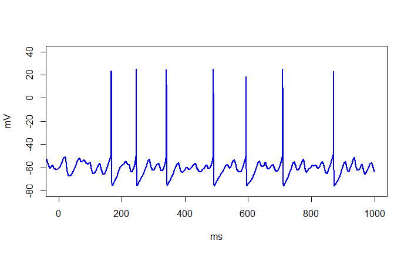
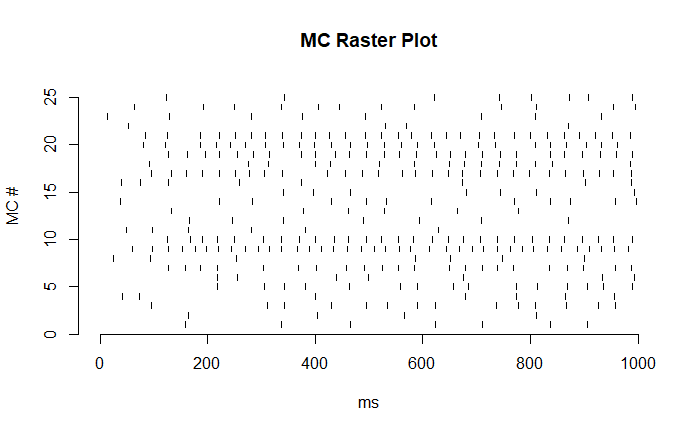

# Olfactory Bulb Model 

### Overview 

This repository contains the simulation code and results for the olfactory bulb spike train model used in my master's research paper titled "Computational Tools for the Simulation and Analysis of Spike Trains". 

The paper aims to illustrate a workflow for running spiking neuron network simulations written for NEURON, a popular simulation environment for modeling networks of neurons ([NEURON 2024](#references)), by interfacing simulations through Python, a popular high-level programming language, and performing statistical analyses through R, a programming language for statistical computing and data analysis.

This was achieved by replicating the plots and results of a model by [Li and Cleland (2017)](#references). 
It also explores the model by modifying the initial random seed and connectivity parameters. 
The orignal model may be found in [ModelDB](https://modeldb.science/232097). 


### Spike Trains

To be clear, this repository contains a model for simulating **spike trains** based on the neuron model by  [Hodgkin and Huxley (1952)](#references). This is a standard model used in computational neuroscience. It 
is a different neuron model compared to the popular perceptron-based neuron model used in modern artificial intelligence and deep learning. To help differentiate the two, I will provide a brief overview on spike trains. 



In Computational Neuroscience, a fundamental area of research is focused on the modeling of neuron action potentials (APs), otherwise known as spikes, with sequences of spikes referred to as spike trains [(Kass et al. 2018)](#references). Physically, spikes are generated by the movement of ions against concentration gradients across a neuron's membrane through ion pumps. This creates a difference in electrical potential between the neuron and the extracellular environment [(Dayan and Abbott 2001)](#references). When a neuron's membrane electrical potential rises past a threshold, a spike occurs [(Dayan and Abbott 2001)](#references). Neuron spikes can be thought of as identical events, where a spike either occurs or does not occur, exhibiting an *all-or-nothing* behavior [(Katz 1966)](#references). 

The figure above depicts a spike train with multiple spikes occurring within 1000 milliseconds or 1 second. Spikes can be seen rising past some threshold between -20 mV to 20 mV. Although each spike is considered to be identical, note that there are minor differences in peak electrical potential between each  spike. Subthreshold potentials are also visible, but since they do not rise past the threshold, they are not considered spikes. This illustrates the *all-or-nothing* behavior mentioned previously.



When visualizing the activity of a network of neurons, using the voltage plot for each individual neuron can be unintuitive to interpret. Since we focus mostly on whether a neuron fires or not, we can instead use a raster plot. The raster plot represents the firing of a network of neurons across time. Each small bar represents the firing of a neuron at a specific point in time. The raster plot above shows the simulated network activity of a population of 25 mitral cells, a type of neuron. The x-axis denotes the time of firing while the y-axis labels which mitral cell is firing. With this visualization, we can much better visualize the firing rates of each neuron as well as observe any synchronicity and coherence at a glance.


## Usage and Installation

This repository contains three folders:

- **figures** : This folder contains the image files for plots generated by the simulation. These images were used as figures in my paper
- **OBGAMMA** : This folder contains the NEURON simulation code for the model by [Li and Cleland (2017)](#references). It also contains a jupyter notebook `simulator.ipynb` to help run and interface with the NEURON simulation. 
- **simulation_data** : This folder contains the simulation results for the default model simulation along with the results for different seeds and connectivity parameters. Each set of data contains an R markdown notebook `plotting.rmd` for generating plots.

Ensure that NEURON, Python, and R are installed before proceeding. The following instructions are intended for a Unix machine. If you wish to run the model as-is from ModelDB, please see Appendix A of my paper which details the steps to do so. If you are using Windows, you may run into some problems running NEURON. If you are using macOS and/or encounter some problems, please follow the steps to download and run the simulation detailed in Appendix A of my paper.

In order to run the simulation, please follow these steps:

1. Clone or download this repository.
2. Navigate to the OBGAMMA folder in a terminal.
```
cd "path/to/OBGAMMA"
```
Ensure that you replace "path/to/OBGAMMA" with the path to the OBGAMMA folder on your machine.

3. Create a python environment.
```
python3 -m venv env
```
4. Activate the environment.
```
source env/bin/activate
```
5. Install all dependencies in the requirements.txt file using pip.
```
pip3 install -r requirements.txt
```
6. Compile the NEURON files.
```
nrnivmodl
```
7. Within VSCode, open the simulator.ipynb file. 
8. Run each cell in order to run a simulation.

Once the simulation has finished (may take up to 2 hours), ensure that you save a copy of the **data0** folder elsewhere on your machine to avoid having to run the same simulation again. 

In order to generate plots based on the results of a simulation, you may use any of the `plotting.rmd` files in any of the **simulation_data** scenarios as a template. Make sure to set the working directory in R to the appropriate data folder on your machine in order for the correct plots to generate.

If you wish to modify any of the parameters of the simulation, please modify the corresponding variable in the `Parameter.hoc` file which may be found under the **OBGAMMA** folder. 

## References
- Dayan, P., and L. F. Abbott. 2001. _Theoretical Neuroscience: Computational and Mathematical Modeling of Neural Systems_. The MIT Press.
- Hodgkin, Alan L, and Andrew F Huxley. 1952. "A quantitative description of membrane current and its application to conduction and excitation in nerve." _The Journal of physiology_ 117 (4): 500–544.
- Kass, Robert E., Shun-Ichi Amari, Kensuke Arai, Emery N. Brown, Casey O. Diekman, Markus Diesmann, Brent Doiron, et al. 2018. "Computational Neuroscience: Mathematical and Statistical Perspectives" [in eng]. PMC6451918, _Annual Review of Statistics and Its Application_ 5 (March): 183-214. ISSN: 2326-8298, 2326-831X. [https://doi.org/10.1146/annurev-statistics-031017-100204](https://doi.org/10.1146/annurev-statistics-031017-100204).
- Katz, B. 1966. _Nerve, Muscle and Synapse_. McGraw-Hill.
- Li, G, and TA Cleland. 2017. "A coupled-oscillator model of olfactory bulb gamma oscillations." _PLoS Comput Biol_ 13, no. 11 (November 15, 2017): e1005760. [https://doi.org/10.1371/journal.pcbi.1005760](https://doi.org/10.1371/journal.pcbi.1005760).
- NEURON. 2024. What is NEURON? [https://www.neuron.yale.edu/neuron/what_is_neuron](https://www.neuron.yale.edu/neuron/what_is_neuron). Accessed: 2024-03-11
